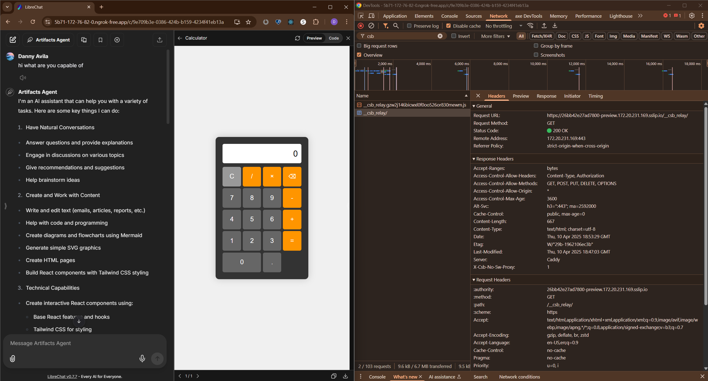

# Static Browser Server for Sandpack 

## Self-Hosting Guide for LibreChat

This repository contains the static browser server used by [Sandpack](https://sandpack.codesandbox.io/), with step-by-step instructions specifically tailored for [LibreChat](https://github.com/danny-avila/LibreChat) integration. This guide explains the complete self-hosting process to enable code execution previews in LibreChat environments.

The [official Sandpack documentation](https://sandpack.codesandbox.io/docs/advanced-usage/static) only briefly mentions self-hosting is possible, providing minimal guidance:

```
"To setup a static browser server, setup a preview controller pointing to the 
static-browser-server preview files hosted on a wildcard domain..."
```

This repository fills that gap with detailed deployment instructions specifically designed for LibreChat users who need to self-host the Sandpack static browser server for enhanced control, performance, and security compliance.

## Table of Contents

- [Overview](#overview)
- [Self-Hosting Guide](#self-hosting-guide)
  - [Why Wildcard Domains Are Necessary](#why-wildcard-domains-are-necessary)
  - [Self-Hosting Requirements](#self-hosting-requirements)
  - [Local Development Setup](#local-development-setup)
    - [Step 1: Generate Wildcard Certificates](#step-1-generate-wildcard-certificates)
    - [Step 2: Configure Caddy as a Reverse Proxy](#step-2-configure-caddy-as-a-reverse-proxy)
    - [Step 3: Import Certificates to Browser](#step-3-import-certificates-to-browser)
    - [Step 4: Run the Static Server](#step-4-run-the-static-server)
    - [Step 5: Configure Sandpack](#step-5-configure-sandpack)
  - [Production Deployment](#production-deployment)
    - [Step 1: Register a Domain](#step-1-register-a-domain)
    - [Step 2: Configure DNS with Wildcard Support](#step-2-configure-dns-with-wildcard-support)
    - [Step 3: Obtain a Wildcard SSL Certificate](#step-3-obtain-a-wildcard-ssl-certificate)
    - [Step 4: Set up a Production-Grade Reverse Proxy](#step-4-set-up-a-production-grade-reverse-proxy)
    - [Step 5: Deploy the Static Server](#step-5-deploy-the-static-server)
    - [Step 6: Configure Clients](#step-6-configure-clients)
  - [Security Considerations for Production](#security-considerations-for-production)
- [How It Works](#how-it-works)
- [Final Thoughts](#final-thoughts)
- [License](#license)

## Overview

The static browser server enables secure, isolated browser environments for running static web content. It works by:

1. Creating a unique ID for each preview session
2. Prepending this ID to the domain as a subdomain (e.g., `[random-id]-preview.static.domain.com`)
3. Using this unique origin to ensure complete isolation between previews through the browser's Same-Origin Policy
4. Leveraging Service Workers to intercept network requests and serve virtual files provided by the parent application (e.g., LibreChat via Sandpack).

## Self-Hosting Guide

While CodeSandbox hosts a public version, self-hosting is necessary for environments requiring network isolation or specific compliance controls. This guide details the steps required.

### Why Wildcard Domains Are Necessary

The subdomain approach provides critical security benefits:

- **Sandbox Isolation**: Each preview runs in its own browser origin
- **Service Worker Isolation**: Prevents service worker conflicts between previews
- **Data Protection**: One preview cannot access cookies, localStorage, or DOM from another preview
- **Security**: Mitigates cross-site scripting and other vulnerabilities

### Self-Hosting Requirements

1.  **Domain Name:** A domain you control.
2.  **Wildcard DNS:** Ability to configure wildcard DNS records that will match the pattern `RANDOMID-[your-configured-domain]`. For example, if you configure `SANDPACK_STATIC_BUNDLER_URL=https://preview.yourdomain.com` (a LibreChat-specific environment variable), you need DNS to support both `preview.yourdomain.com` and any subdomain of your domain (e.g., `*.yourdomain.com`).
3.  **Wildcard SSL/TLS Certificate:** A valid certificate covering both your base domain and the wildcard domain. For example, if you configure `SANDPACK_STATIC_BUNDLER_URL=https://preview.yourdomain.com`, your certificate needs to cover both `preview.yourdomain.com` and `*.yourdomain.com`. Standard wildcard certificates (not specific to the prefix pattern) work correctly with this system.
4.  **Reverse Proxy:** A server like Nginx, Caddy, Traefik, etc., capable of handling HTTPS/TLS termination and proxying requests.
5.  **Node.js Environment:** A server environment to run the Node.js static server application.
6.  **HTTPS is Mandatory:** Service Workers require a secure context, meaning your self-hosted static server **must** be served over HTTPS with a valid certificate.

### Local Development Setup (Reference for Production)

This local setup demonstrates the core components needed. Use it as a reference when configuring your production environment.

### Understanding the URL Pattern (CRITICAL)

The most important thing to understand about this system is how the `SANDPACK_STATIC_BUNDLER_URL` configuration works (this is a LibreChat environment variable, not a variable for this static server):

1. **Random ID Prefixing:** When you set `SANDPACK_STATIC_BUNDLER_URL` to any value, the system will **prepend a random ID** to the **entire hostname** part of that URL.

2. **Examples:**
   - If you set: `SANDPACK_STATIC_BUNDLER_URL=https://yourdomain.com`
     - Requests go to: `https://RANDOMID-yourdomain.com`
   - If you set: `SANDPACK_STATIC_BUNDLER_URL=https://sandpack.yourdomain.com`
     - Requests go to: `https://RANDOMID-sandpack.yourdomain.com`
   - If you set: `SANDPACK_STATIC_BUNDLER_URL=https://preview.sandpack.yourdomain.com`
     - Requests go to: `https://RANDOMID-preview.sandpack.yourdomain.com`

3. **DNS and Certificate Requirements:** Your DNS and SSL certificates must be configured to handle this pattern. Based on our testing, you need:
   * A standard wildcard certificate for `*.yourdomain.com` (not specifically for `*-sandpack.yourdomain.com`)
   * DNS configuration that resolves both your base domain and any subdomain to your server

4. **Choosing Your Domain:** You can use any domain structure you prefer (single domain, subdomain, multiple subdomains), as long as you configure your DNS and certificates to handle the random ID prefix pattern.

**Important Notes for Local Testing:**

1. **HTTPS is Required:** The URL provided to your client application (like LibreChat via `SANDPACK_STATIC_BUNDLER_URL`) **must** be HTTPS because Service Workers require a secure context. The steps below using `mkcert` and Caddy ensure the *static server itself* runs on HTTPS locally. If your *client application* (e.g., LibreChat) is also running locally and needs to access this HTTPS URL, you might need additional steps like using a tunneling service (e.g., `ngrok`) to expose your local setup via a public HTTPS URL, or configuring the client application's local environment to trust your `mkcert` CA.

For local testing, you can use:

1. **sslip.io** or **nip.io** as a wildcard DNS service that automatically resolves to your IP
2. **mkcert** for generating trusted SSL certificates
3. **Caddy** as a reverse proxy with automatic HTTPS support

#### Step 1: Generate Wildcard Certificates

```bash
# Install mkcert
sudo apt install libnss3-tools
curl -JLO "https://dl.filippo.io/mkcert/latest?for=linux/amd64"
chmod +x mkcert-v*-linux-amd64
sudo mv mkcert-v*-linux-amd64 /usr/local/bin/mkcert

# Create and install certificates
mkcert -install
mkdir -p ~/certs
cd ~/certs
# Replace 192.168.1.100 with your actual local IP address.
# You can find your local IP using `ip addr show` on Linux or `ipconfig` on Windows.
# Choose a domain pattern for your static server, e.g., "preview.192.168.1.100.sslip.io"
# The certificate needs to cover both the base domain and the wildcard domain
# IMPORTANT: Use "*.192.168.1.100.sslip.io" (not "*-preview.192.168.1.100.sslip.io")
mkcert "preview.192.168.1.100.sslip.io" "*.192.168.1.100.sslip.io"
```

#### Step 2: Configure Caddy as a Reverse Proxy

Create a `Caddyfile` with the following content:

```
{
  debug
}

# Update domain to match the certificate you generated
# IMPORTANT: Use "*.192.168.1.100.sslip.io" for the wildcard domain in both the certificate
# and the Caddy configuration - this is critical for proper functionality
preview.192.168.1.100.sslip.io, *.192.168.1.100.sslip.io {
  # CORS headers
  header {
    Access-Control-Allow-Origin "*"
    Access-Control-Allow-Methods "GET, POST, PUT, DELETE, OPTIONS"
    Access-Control-Allow-Headers "Content-Type, Authorization"
    Access-Control-Max-Age "3600"
  }
  
  # Handle OPTIONS requests
  @options {
    method OPTIONS
  }
  respond @options 204
  
  # Proxy to our static server (replace IP if needed)
  reverse_proxy 192.168.1.100:4324
  # Replace /path/to/your/certs and filenames to match your generated certificates
  tls /path/to/your/certs/preview.192.168.1.100.sslip.io+1.pem /path/to/your/certs/preview.192.168.1.100.sslip.io+1-key.pem
}
```

Replace `192.168.1.100` with your actual local IP address, update the domain names to match Step 1, and update the certificate paths in the `tls` directive.

#### Step 3: Import Certificates to Browser

Assuming you are using the latest version of Chrome:

- In Chrome: Settings → Privacy and security → Security → Manage certificates
  - Or, goto: chrome://certificate-manager/
- Select "Local certificates" tab → Custom → "Installed by you" → Import
- Browse to the rootCA.pem file (located in `~/.local/share/mkcert/rootCA.pem`, or wherever you save it)
- Restart Chrome

#### Step 4: Run the Static Server

Clone this repository and run:

```bash
npm install
npm run build
npm run start:demo
```

**Note:** This `start:demo` script runs a minimal Fastify server defined in `servers/demo-server.ts`. This is intended for local testing and demonstration purposes only. For production, you should adapt this or implement a more robust Node.js server deployment strategy (e.g., using PM2, Docker, or your organization's standard deployment methods) to run the compiled server code (e.g., `node out/servers/demo-server.js`).

The server listens on port 4324 by default (configurable via the `.env` file or environment variables).

#### Step 5: Configure LibreChat (or other client application)

Configure your application (e.g., LibreChat) to use the **base HTTPS URL** of your self-hosted static server. For LibreChat, this is typically done via an environment variable in the LibreChat `.env` file:

```bash
# In your LibreChat `.env` file or environment configuration
# Use the domain you configured in Caddy and mkcert (must be HTTPS)
SANDPACK_STATIC_BUNDLER_URL=https://preview.192.168.1.100.sslip.io
```

**Remember:** The value you set for `SANDPACK_STATIC_BUNDLER_URL` determines the exact domain pattern that will be used. The random ID is prepended to the entire hostname part of your URL. Your DNS, certificates, and proxy must be configured to handle this exact pattern.

### Production Deployment Overview

Deploying to production involves replicating the core components demonstrated in the local development setup, but using production-grade tools and configurations. The key requirements are:

1.  **Domain Name:** A registered domain where you will host the static server (e.g., `yourdomain.com`). You'll typically use a dedicated subdomain for this service (e.g., `preview.yourdomain.com`).

2.  **Wildcard DNS Configuration:** 
    * **Important:** Based on our testing, you need a standard wildcard DNS record (`*.yourdomain.com`), not a specific pattern like `*-preview.yourdomain.com`.
    * Configure your DNS provider with:
      * An `A` record for your base domain (e.g., `preview.yourdomain.com`) pointing to your server's IP
      * A wildcard `A` record (`*.yourdomain.com`) pointing to the same IP address
    * This configuration allows both the base domain and any random-ID prefixed subdomains to resolve correctly

3.  **Wildcard SSL/TLS Certificate:** 
    * **Important:** You need a standard wildcard certificate that covers both:
      * Your base domain (e.g., `preview.yourdomain.com`)
      * The wildcard domain (e.g., `*.yourdomain.com`)
    * Let's Encrypt with DNS validation is a common way to obtain wildcard certificates
    * Do not try to create certificates specifically for the `*-preview.yourdomain.com` pattern - standard wildcard certificates work correctly with this system

4.  **Reverse Proxy Configuration:** 
    * Set up a production-grade reverse proxy (like Nginx, Caddy, Traefik, or your cloud provider's load balancer)
    * Configure it with your wildcard certificate
    * Ensure it handles HTTPS/TLS termination and proxies requests to your Node.js static server
    * Configure proper CORS headers (`Access-Control-Allow-Origin "*"` etc.)
    * In your proxy configuration, include both the base domain and wildcard domain in the server_name/host directive

5.  **Node.js Server Deployment:**
    * Clone this repository (`git clone https://github.com/codesandbox/static-browser-server.git`)
    * Install dependencies (`npm install`)
    * Build the production assets (`npm run build`)
    * Deploy the built Node.js application using a process manager (like PM2), containerization (Docker), or your preferred deployment strategy
    * Ensure you run the compiled server script (e.g., `node out/servers/demo-server.js`), **not** using development tools like `esbuild-register`
6.  **Client Configuration (LibreChat):** Configure LibreChat (or your client application) to use your production **base HTTPS URL** via the appropriate environment variable in the LibreChat `.env` file:
    ```bash
    # In your LibreChat `.env` file or environment configuration
    # Use the domain you configured (must be HTTPS)
    # You can use any domain structure you prefer, as long as your DNS and certificates
    # are configured to handle the random ID prefix pattern
    # Note: SANDPACK_STATIC_BUNDLER_URL is a LibreChat-specific environment variable, not a variable for this static server
    SANDPACK_STATIC_BUNDLER_URL=https://preview.yourdomain.com
    ```

    This will result in preview URLs like `https://RANDOMID-preview.yourdomain.com`.
    
    Alternatively, you could use:
    ```bash
    SANDPACK_STATIC_BUNDLER_URL=https://sandpack.yourdomain.com
    ```
    
    Which would result in preview URLs like `https://RANDOMID-sandpack.yourdomain.com`.

#### You will now be able to generate an HTML-based (Static) Artifact via LibreChat Artifacts:


Refer back to the local development steps for examples of how each component (certificates, reverse proxy, server process) works together. Remember that HTTPS is mandatory and the random ID prefix pattern must be supported by your DNS and certificates.

### Security Considerations for Production

1. **Rate limiting**: Implement rate limiting to prevent abuse
2. **Proper SSL configuration**: Use modern TLS versions and secure ciphers
3. **Regular certificate renewal**: Set up auto-renewal for your wildcard certificates
4. **Monitoring**: Implement proper monitoring for server health and security issues
5. **Firewall rules**: Restrict access to only necessary ports
6. **Content Security Policy**: Consider implementing CSP headers for additional security

## How It Works (Simplified)

1.  **Static Server Deployment**: The Node.js application you deploy (from this repository). It serves the core relay and service worker files.
2.  **Relay**: A hidden iframe loaded by the client application (e.g., Sandpack within LibreChat) from your deployed server's domain. It acts as a communication bridge.
3.  **Service Worker**: Registered by the Relay. It intercepts network requests *within the isolated preview environment* (e.g., `[random-id]-sandpack.yourdomain.com`).

When a preview is initialized by the client application (like Sandpack in LibreChat):

1.  The client generates a unique preview URL by prepending a random ID to your configured domain (e.g., if you set `SANDPACK_STATIC_BUNDLER_URL=https://preview.yourdomain.com`, it becomes `https://RANDOMID-preview.yourdomain.com`).
2.  The client loads the Relay iframe from your server (e.g., `https://preview.yourdomain.com/__csb_relay/`).
3.  The Relay registers the Service Worker for the unique preview origin.
4.  The Service Worker intercepts requests within the preview iframe.
5.  Requests are sent back to the client application (via the Relay) to get the actual file content.
6.  The client application provides the content (e.g., HTML, CSS, JS).
7.  The Service Worker serves this content within the isolated preview iframe.

This architecture ensures complete isolation between different previews, as each preview runs in its own browser origin.

## Final Thoughts

The wildcard domain approach is a critical security feature for sandbox isolation. By following this guide, administrators can deploy this static server to enable secure code previews within applications like LibreChat, while maintaining control over their infrastructure.

## License

Apache-2.0
